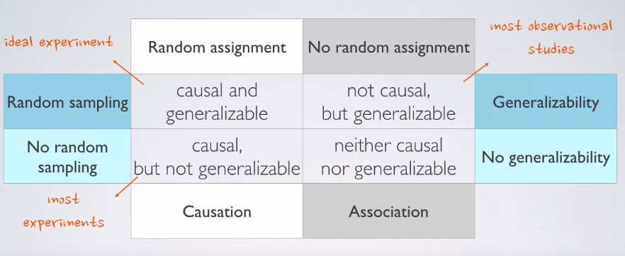
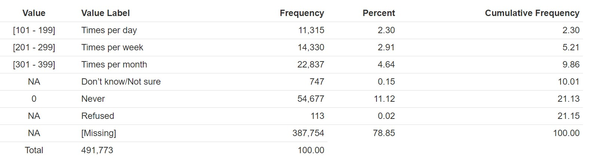

## Setup

### Load packages

```{r load-packages, message = FALSE}
library(ggplot2)
library(dplyr)
```

### Load data


```{r load-data}
load("brfss2013.RData")
```
 

* * *

## Part 1: Data

First, let's look at the information of the dataset which we are dealing with:

### The Behavioral Risk Factor Surveillance System (BRFSS) - 2013 

From [BRFSS Overview](https://www.cdc.gov/brfss/annual_data/2013/pdf/Overview_2013.pdf)

The Behavioral Risk Factor Surveillance System (BRFSS) is a collaborative project between all of the states in the United States (US) and participating US territories and the Centers for Disease Control and Prevention (CDC). The BRFSS is administered and supported by CDC’s Population Health Surveillance Branch, under the Division of Population Health at the National Center for Chronic Disease Prevention and Health Promotion. BRFSS is an ongoing surveillance system designed to measure behavioral risk factors for the non-institutionalized adult population (18 years of age and older) residing in the US. The BRFSS was initiated in 1984, with 15 states collecting surveillance data on risk behaviors through monthly telephone interviews. Over time, the number of states participating in the survey increased; by 2001, 50 states, the District of Columbia, Puerto Rico, Guam, and the US Virgin Islands were participating in the BRFSS. Today, all 50 states, the District of Columbia, Puerto Rico, and Guam collect data annually and American Samoa, Federated States of Micronesia, and Palau collect survey data over a limited point- in-time (usually one to three months). In this document, the term “state” is used to refer to all areas participating in BRFSS, including the District of Columbia, Guam, and the Commonwealth of Puerto Rico.

The BRFSS objective is to collect uniform, state-specific data on preventive health practices and risk behaviors that are linked to chronic diseases, injuries, and preventable infectious diseases that affect the adult population. Factors assessed by the BRFSS in 2013 include tobacco use, HIV/AIDS knowledge and prevention, exercise, immunization, health status, healthy days — health-related quality of life, health care access, inadequate sleep, hypertension awareness, cholesterol awareness, chronic health conditions, alcohol consumption, fruits and vegetables consumption, arthritis burden, and seatbelt use. Since 2011, BRFSS conducts both landline telephone- and cellular telephone-based surveys. In conducting the BRFSS landline telephone survey, interviewers collect data from a randomly selected adult in a household. In conducting the cellular telephone version of the BRFSS questionnaire, interviewers collect data from an adult who participates by using a cellular telephone and resides in a private residence or college housing.

Health characteristics estimated from the BRFSS pertain to the non-institutionalized adult population, aged 18 years or older, who reside in the US. In 2013, additional question sets were included as optional modules to provide a measure for several childhood health and wellness indicators, including asthma prevalence for people aged 17 years or younger.

### Review some useful concepts 
form [Introduction to Probability and Data course offered by Duke university](https://www.coursera.org/learn/probability-intro)

Observational studies can provide evidence of a naturally occurring association between variables, but they cannot by themselves show a causal connection. Researchers perform an observational study when they collect data in a way that does not directly interfere with how the data arise. For instance, researchers may collect information via
surveys, review medical or company records, and etc.

When researchers want to investigate the possibility of a causal connection, they conduct an experiment. To check if there really is a causal connection between the explanatory variable and the response, researchers will collect a sample of individuals and split them into groups. The individuals in each group are assigned a treatment. When individuals are randomly assigned to a group, the experiment is called a randomized experiment.

There is a good table categorizing these concepts from the course video in the week 1. It emphasizes that most of the observational studies have random sampling but not random assignments and therefore are not casual , but generalizable:

<center>

 

</center>


Let's now investigate BRFSS dataset:

Based on what we have reviewed, we can say that BFRSS survey is an **observational study**. The reason is that in conducting the BRFSS landline telephone survey, interviewers collect data from a randomly selected adult in a household. We only have chosen samples randomly through selected adults, therefore resulted sample may represent the population. So,this study is generalizable to the population at large. However,Since 2011 BRFSS conducts both land-line telephone- and cellular telephone-based surveys. For the cellular telephone-based surveys, interviewers collect data from an adult who participates by using a cellular telephone and resides in a private residence or college housing. This part of the study is not randomly selected. Therefore, it may raise convenience bias. So, for this part, we would not generalize the sample to the whole population.  

On the other hand, since the study does not use of any random assignment, it can't be used for causality study.Random assignment only occurs in experimental settings. Through random assignment we ensure that different characteristics are represented equally in treatment and control groups. Also, random assignment allows us to make causal conclusions based on the study. 


* * *

## Part 2: Research questions

In this part, we want to contemplate some research questions. 
The BRFSS objective is to collect uniform, state-specific data on preventive health practices and risk behaviors that are linked to **chronic diseases**, **injuries**, and **preventable infectious diseases** that affect the adult population.Thus, it would be interesting to look at some factors like tobacco use, HIV/AIDS knowledge and prevention, exercise, immunization, health status, healthy days — health-related quality of life, health care access, inadequate sleep, hypertension awareness, cholesterol awareness, chronic health conditions, alcohol consumption, fruits and vegetables consumption, arthritis burden, and seatbelt use.


**Here I will only investigate 3 research questions:**


**Research question 1:**

As a first question, we might be interested in exploring the factors may have a relationship with the chronic diseases like heart attach. Some of the factors seem more likely to have relationship with are:

- Hypertension awareness,
- Cholesterol awareness, 
- Alcohol consumption
- Exercise 
- Tobacco use 

For the first question I'd like to focus on some of the above factors. From the codebook I will choose the below columns and variables to specifically investigate heart attack case:


- **cvdinfr4**: Ever Diagnosed With Heart Attack

- _**rfchol**: High Cholesterol Calculated Variable

- _**rfsmok3**: Current Smoking Calculated Variable

- _**rfhype5**: High Blood Pressure Calculated Variable


**Research question 2:**

As a second question, I will look at the relationship between having diabetes 
and factors like age , and sugar consumption. We may have an idea that sugar consumption is one of the factors of having diabetes. Also, we might be interested on relationship between age and diabetes. For both of these variables we need to look at the codebook and explore them more.
Thus, form the codebook I will choose the below columns and variables:


- **diabete3:** (Ever Told) You Have Diabetes

- **diabage2:** Age When Told Diabetic
 
- **ssbfrut2:** How Often Did You Drink Sugar-Sweetened Drinks?


**Research question 3:**

For the third question, we might be interested in exploring the relationship between exercise and metal health status.

Finally, for this question, form the codebook I will choose the below columns and variables:


- **exerany2:** Exercise In Past 30 Days

- **misdeprd:** How Often Feel Depressed Past 30 Days

- **mishopls:** How Often Feel Hopeless Past 30 Days

* * *

## Part 3: Exploratory data analysis


**Research question 1:**


 To achieve this, we familiarize ourselves with the variables **cvdinfr4**,     _**rfchol** , _**rfsmok3**, and _**rfhype5**. First we check the codebook (see Appendix), then we explore the data. 
 
  We can use the dplyr chain to select the variables of interest and investigate only their structure by adding str() at the end of the chain:


let's select 3 variable:
```{r eval=FALSE}
brfss2013 %>% 
 select(cvdinfr4,_rfchol,_rfsmok3,_rfhype5) %>% 
 str()
```
We got an error! Nice, this is a part of EDA! Your job is to find relevant data you want. So let's find the error source. If we look at the names of columns in the dataset we'll find out that we need to add X letter at the front of some of the above variables. 


```{r eval=FALSE}
names(brfss2013)
```
Now, we run the code again with corrected variable names;
```{r}
brfss2013 %>% 
 select(cvdinfr4,X_rfchol,X_rfsmok3,X_rfhype5) %>% 
 str()
```
These are factor variables, in fact they are ordinal and by default the levels are listed in alphabetical order. Since they are categorical variables, we can summarize the occurrences of each level with group_by() and summarise():


```{r}
brfss2013 %>% 
  group_by(cvdinfr4) %>% 
  summarise(count = n())
```

We have an error telling us Factor `cvdinfr4` contains implicit NA, consider using `forcats::fct_explicit_na`. If we check this data from codebook we could see NA value which is related to Don't know/ Not sure, Refused and Missing labels. So, we might want to exclude these observations from our analysis. We can do so by filtering them out.
```{r}
brfss2013 %>% 
  filter( cvdinfr4 != "Don't know") %>%
  group_by(cvdinfr4) %>% 
  summarise(count = n())
```
Note that adding the filter also got rid of the NA entries. NA (Not Available) is used to indicate blank entries – those observations for which there is no data recorded.

**We can also visualize and describe single categorical variables through bar plots: **

```{r}
ggplot(data=brfss2013, aes(x=cvdinfr4)) +
  geom_bar() +xlab("Ever Diagnosed With Heart Attack") 
```

We can also similarly view the levels for the other variables;

```{r}
brfss2013%>% 
  group_by(X_rfchol) %>% 
  summarise(count = n())
```
This set also has NA entries, 
```{r}
brfss2013 %>% 
  filter(!is.na(X_rfchol)) %>%
  group_by(X_rfchol) %>% 
  summarise(count = n())
```
For the smoking variable; 
```{r}
brfss2013%>% 
  filter(!is.na(X_rfsmok3)) %>%
  group_by(X_rfsmok3) %>% 
  summarise(count = n())
```

Again for hypertension variable; 
```{r}
brfss2013%>% 
  filter(!is.na(X_rfhype5)) %>%
  group_by(X_rfhype5) %>% 
  summarise(count = n())
```

Now, I want to evaluate relationship between two categorical variables. One of the ways is contingency table. But, for better visualization I choose segmented bar plot to see if the 3 variables or factors are associated with heart attack or not. Via visualization we may notice a relationship between each of the factors related to depended variables which here is having heart attack:

```{r}
heart_attack_smoking <- brfss2013 %>%
  filter(! is.na(cvdinfr4), ! is.na(X_rfsmok3))  %>%
  select(cvdinfr4, X_rfsmok3) 
ggplot(heart_attack_smoking , aes(fill= X_rfsmok3, x=cvdinfr4 ) ) + 
    geom_bar(position = "fill") + xlab("having heart attack considering if person smokes or not") + ylab("Proportion") + scale_fill_discrete(name="Do you smoke?")
```


As we observe from the above plot, there is not very clear relationship between person smoking status with having heart attack. For both bars the proportion is almost similar. Let's investigate two other variables, high cholesterol and high blood pressure. We will see these factors are more likely related to hear attack; 

```{r}
heart_attack_cholesterol <- brfss2013 %>%
  filter(! is.na(cvdinfr4), ! is.na(X_rfchol))  %>%
  select(cvdinfr4, X_rfchol) 
ggplot(heart_attack_cholesterol, aes(fill=X_rfchol  , x=cvdinfr4 ) ) + 
    geom_bar(position = "fill") + xlab("having heart attack ") + ylab("Proportion") + scale_fill_discrete(name="High Cholesterol?")
```


We can see that people who ever had a heart attack mostly had have a high cholesterol. And, for the people didn't have heart attack we see more No or not having high cholesterol. Therefore, we might say that it is likely having heart attack is related to high cholesterol.  


```{r}
heart_attack_blood_pre <- brfss2013 %>%
  filter(! is.na(cvdinfr4), ! is.na(X_rfhype5))  %>%
  select(cvdinfr4, X_rfhype5) 
ggplot(heart_attack_blood_pre, aes(fill=X_rfhype5 , x=cvdinfr4 ) ) + 
    geom_bar(position = "fill") + xlab("having heart attack  ")+ylab("Proportion") + scale_fill_discrete(name="High blood pressure?")
```


Very similar to cholesterol we observe that people who ever had a heart attack mostly had have a high blood pressure. Therefore, we might say that it is likely having heart attack is related to having high blood pressure.

To sum up, as an answer to the first question, we observe that having heart attack is more related to high cholesterol and high pressure rather than smoking. 


**Research question 2:**

Let's first look at the variables we want to explore from the codebook. 

 
let's select 3 variable for the second question:
```{r }
question2 <-brfss2013 %>% 
 select(diabete3,diabage2,ssbfrut2) %>% 
 na.omit()
```
we can look the type of the variables using `str()` :


```{r}
question2 %>%
  str()
```


we have two factor types which are ordinal categories, and the int type.

First we use `group_by` together with `summarize` to view the value counts in the `diabete3` variable:
```{r}
question2%>% 
  group_by(diabete3) %>% 
  summarise(count = n())
```

It is nice to also look at the bar plot to better visualize this variable. 

```{r}
ggplot(data=question2, aes(x=diabete3)) +
  geom_bar() +xlab("Diabetes status") 
```

I want to have only yes and no labels for may diabetes status. I think it would help to better investigate its probable relation with other factors like sugar consumption. Thus, I filter others in diabetes variables:

```{r}
question2 <- question2 %>% 
  filter( diabete3 != "Yes, but female told only during pregnancy",diabete3 !="No, pre-diabetes or borderline diabetes" ) 
  
```


Now, if I look at the `diabete3` variable again:
```{r}
ggplot(data=question2, aes(x=diabete3)) +
  geom_bar() +xlab("Diabetes status") 
```


Now we can explore the relationship between sugar consumption and having diabetes, but first let's look on sugar-sweetend drinks consumption.The survey have asked that during the past 30 days, how often did you drink sugar-sweetened fruit drinks (such as Kool-aid and lemonade), sweet tea, and sports or energy drinks (such as Gatorade and Red Bull)? We can look at the summary of the table as below, however from the code book consider labeling:

<center>

 

</center>


We can also investigate the distribution of each value label through histogram :
```{r}

ggplot(data=question2, aes(ssbfrut2)) + 
  geom_histogram(binwidth = 1)

```

I will only investigate having at lease 1 sugar-sweetend drink and not having at all during last 30 days. Then , I will compare it with having diabetes. So let's frist filter other labels. 
```{r}
question2 %>% 
  group_by(ssbfrut2) %>%
  summarise(count= n())
```
```{r}
question2 %>%
  filter(!is.na(ssbfrut2)) %>%
  group_by(diabete3)
```
```{r}
new <- question2 %>% 
  mutate(ssbfrut2 = ifelse(ssbfrut2 == 0, "Not dirnking", ifelse(ssbfrut2< 500, "Drink at least 1 per day", NA)))

```


```{r}
new <-new %>% 
  filter(!is.na(ssbfrut2)) 
 
```

```{r}
ggplot(new, aes(fill=ssbfrut2  , x=diabete3 ) ) + 
    geom_bar(position = "fill")  + ylab("Proportion") +xlab("Whether you have diabetes") + scale_fill_discrete(name="sugar-sweetend drinks:")
```

At first glance it is a very surprising result! How it could be possible those who drink at least 1 per day has less chance to have diabetes!? But, if we look at the data again, we would find that the survey asking during the past 30 days that how often did you drink sugar-sweetened fruit drinks. However, a person may have been told that they have diabetes a month prior than survey! So, we need to look at to this bar plot from another perspective. It is better to think about the relationship between knowing that you have diabetes and drinking less amount of sugar-sweetened drinks!

```{r}
ggplot(new, aes(fill=diabete3, x=ssbfrut2))  + 
    geom_bar(position = "fill")  + ylab("Proportion") + xlab("sugar-sweetend drinks:") + scale_fill_discrete(name="Whether you have diabetes")
```


So, it is possible that if you have diabetes you have more awareness to not consume sugar-sweetend drinks. 


Let's now investigate the relaitonship beteween age and diabetes:

```{r}
question2 %>%
  filter(diabage2 != ".b",diabage2 !=  "") %>%
  group_by(diabage2) %>%
  summarise(count=n()) 
```


```{r}
new_age <-question2 %>%
  filter(diabage2 != ".b",diabage2 !=  "") %>%
  group_by(diabage2) 
  
new_age$diabage2 <- as.numeric(new_age$diabage2) 

new_age_2 <- new_age%>% 
  group_by(diabage2) 
ggplot(new_age_2, aes(x=diabage2)) + geom_histogram(stat = "count")

```


We can see that as people get older the probability that they have diabetes increases. Though there might be a relationship between age and having diabetes. 

**Research question 3:**

Let's jump to the final research question EDA.First we separate these three variables from the dataset to easily work with them:

```{r}
question3 <-brfss2013 %>% 
 select(exerany2,misdeprd,mishopls) %>% 
 na.omit()
```
we can look the type of the variables using `str()` :


```{r}
question3 %>%
  str()
```

Again use `group_by` together with `summarize` to view the value counts in the `exerany2` variable:
```{r}
question3%>% 
  group_by(exerany2) %>% 
  summarise(count = n())
```

Great , we only have the `Yes` and `No` , and it makes our job easy. Now we can see the exercise effect on mental health status.

We can also investigate the distribution of two factoral varables :
```{r}

ggplot(data=question3, aes(misdeprd)) + 
  geom_bar()

```

```{r}

ggplot(data=question3, aes(mishopls)) + 
  geom_bar()

```


Now, I want to see each factor variables relationship with exercising. 


```{r}
ggplot(question3, aes(fill=exerany2, x=misdeprd))  + 
    geom_bar(position = "fill")  + ylab("Proportion") + xlab("How Often Feel Depressed Past 30 Days?") + scale_fill_discrete(name=" Exercise In Past 30 Days?")
```


There is a very strong relation between having exercise and depression reduction. We observe that people who less feel depressed in past 30 days are more likely to ecercise.  

```{r}
ggplot(question3, aes(fill=exerany2, x=mishopls))  + 
    geom_bar(position = "fill")  + ylab("Proportion") + xlab("How Often Feel Hopeless Past 30 Days?") + scale_fill_discrete(name=" Exercise In Past 30 Days?")
```

The trend for the hopeless feeling almost is the same as depression. Again, we can see the strong relation with having exercise and reducing the hopeless feeling. So, let's always workout and be healthy! 


